# Credit Risk Analysis

## Overview
The purpose of this analysis is to use supervised machine learning to determine the credit card risk the lender takes on with their borrowers. Credit card risk is unbalanced because the low-risk loans far outnumber the number of high-risk loans. This dataset from LendingClub has 68,470 `low_risk` and 347 `high_risk` records. To account for the imbalance in types of loans and provide meaningful insight, this analysis uses the `imbalanced-learn` and `scikit-learn` libraries and the `RandomOverSampler`, `SMOTE`, and `ClusterCentroids` algorithms to either oversample or under sample the data. The analysis also uses the combinational `SMOTEENN` algorithm to over- and undersample the data. Finally, we use who machine learning models `BalancedRandomForestClassifier` and `EasyEnsembleClassifier` to reduce bias. This analysis compares the performance of these machine learning methods to predict credit risk and provides a recommendation for the best model. 

## Results
<ins>Oversampling</ins>

RandomOverSampler
* Accuracy: 0.65
* Precision (High-Risk Loans): 0.01
* Recall (High-Risk Loans): 0.70
* Precision (Low-Risk Loans): 1.00
* Recall (Low-Risk Loans):0.59

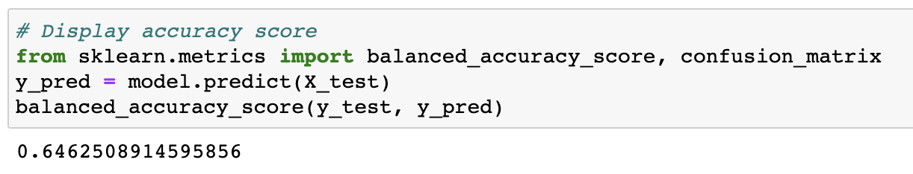
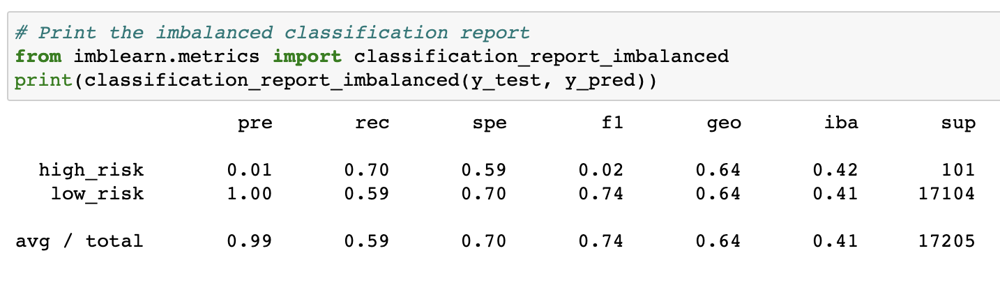

SMOTE
* Accuracy: 0.66
* Precision (High-Risk Loans): 0.01
* Recall (High-Risk Loans): 0.62
* Precision (Low-Risk Loans): 1.00
* Recall (Low-Risk Loans):0.69

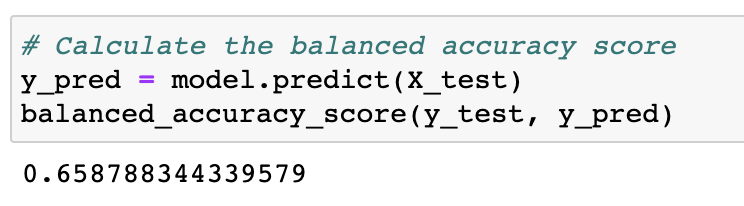
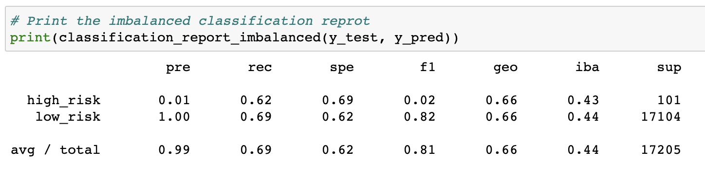

<ins>Undersampling</in>

ClusterCentroids
* Accuracy: 0.54
* Precision (High-Risk Loans): 0.01
* Recall (High-Risk Loans): 0.69
* Precision (Low-Risk Loans): 1.00
* Recall (Low-Risk Loans):0.40

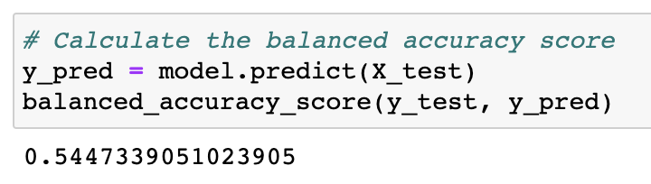
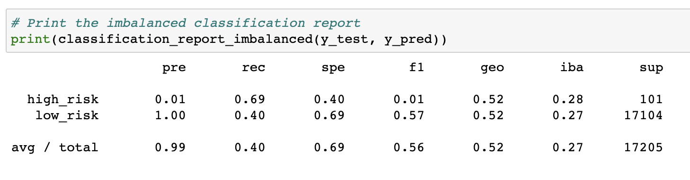

<ins>Combination</ins>

SMOTEENN
* Accuracy: 0.65
* Precision (High-Risk Loans): 0.01
* Recall (High-Risk Loans): 0.71
* Precision (Low-Risk Loans): 1.00
* Recall (Low-Risk Loans):0.58

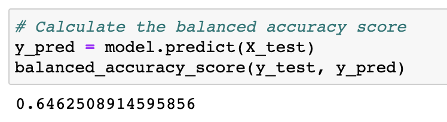
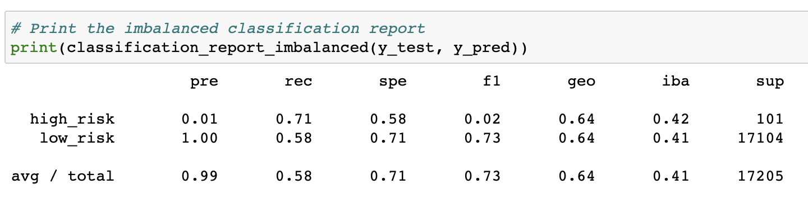

<ins>Ensemble Learning Models</ins>

BalancedRandomForestClassifier
* Accuracy: 0.79
* Precision (High-Risk Loans): 0.03
* Recall (High-Risk Loans): 0.70
* Precision (Low-Risk Loans): 1.00
* Recall (Low-Risk Loans): 0.87

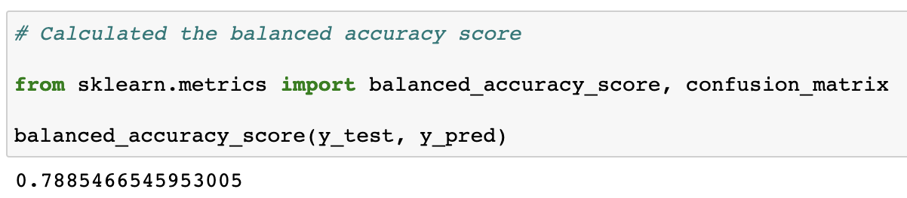
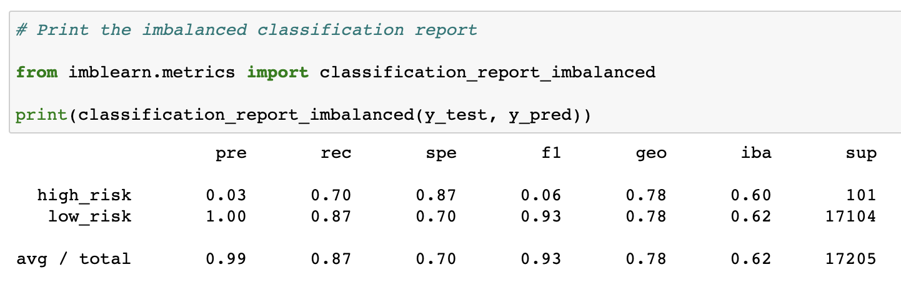

EasyEnsembleClassifier
* Accuracy: 0.93
* Precision (High-Risk Loans): 0.09
* Recall (High-Risk Loans): 0.92
* Precision (Low-Risk Loans): 1.00
* Recall (Low-Risk Loans): 0.94

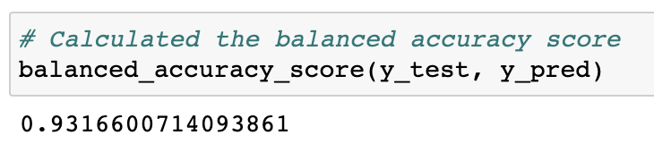
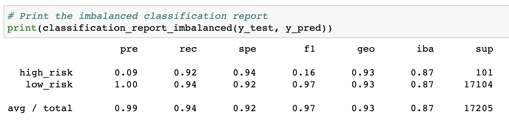

## Summary

When predicting low-risk credit card customers, precision is most important to the lender. However, when predicting high-risk credit card customers, recall is most important. 

Precision measures how reliable a positive classification is. High precision means that the customers the model predicts to be low-risk will actually be low-risk. The tradeoff is that some low-risk customers could be predicted to be high-risk incorrectly. The lender may not offer credit cards or certain rates to some low-risk customers. But with high precision, the lender is less likely to offer a credit card loan to high-risk customers. 

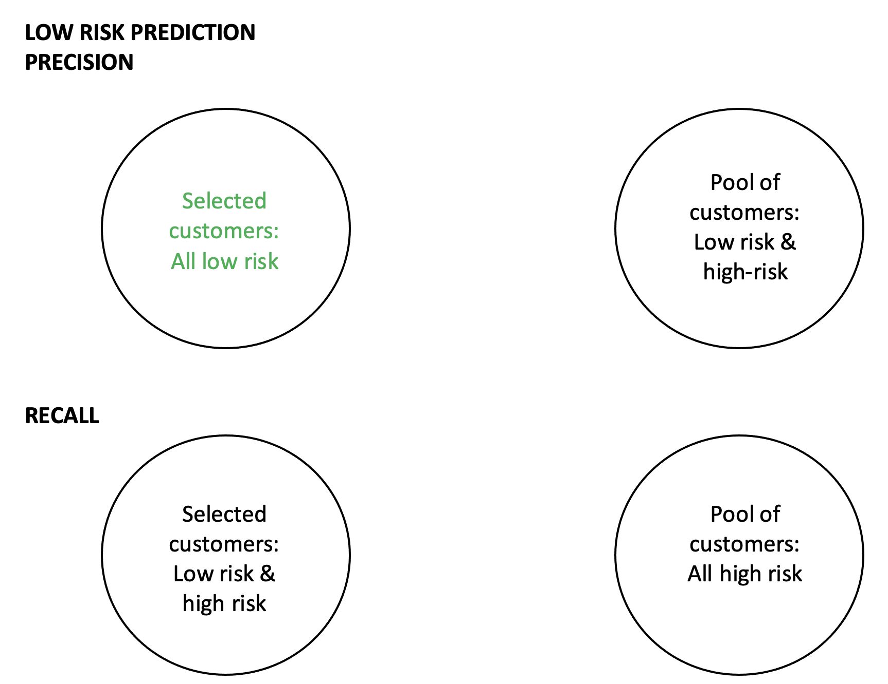

On the other hand, high recall is preferred when determining high-risk customers. Recall is the measure of the model's ability to find all targeted cases in the dataset. With high recall, the model will select all high-risk customers from the model. The tradeoff to this is that the model may also select some low-risk customers as being high-risk. Again, some low-risk customers will be miscategorized as high-risk but the lender limits possibility of offering credit card loans to high-risk customers. 

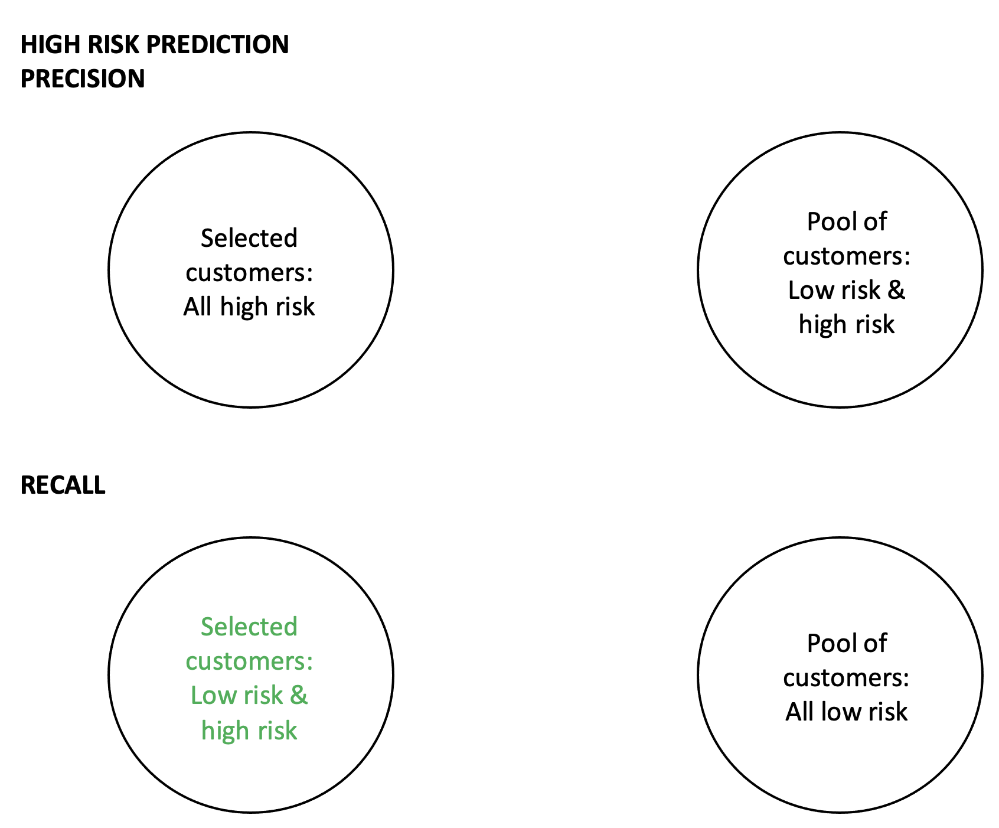

All of the models had low precision for detecting high-risk loans, ranging from 0.01 to 0.09. This means that all models had a large number of false positives (low-risk loans predicted to be high-risk). Conversely, all models had high precision scores of 1.00 for detecting low-risk loans. Recall scores for detecting high-risk loans ranged from 0.62 - 0.92. `SMOTE` had the lowest recall score for high-risk loans and the `EasyEnsembleClassifier` had the highest score. There is a larger range in recall scores for low-risk loans from 0.40 for `ClusterCentroids` to 0.94 for `EasyEnsembleClassifier`. 

 
Based on the results of this analysis, the best machine learning model of the six tested for detecting high-risk credit loans is the `EasyEnsembleClassifer`. This model performed the best for detecting high-risk loans.

Since all of the six models tested received a precision score of 1.00 for detecting low-risk loans, a strong recommendation for the best model for predicting low-risk loans isn't possible. A precision score of 1.0 means that all customers that the model predicted to be low-risk were actually low-risk. When evaluating precision score alone, it looks like all models performed equally perfectly. However, precision alone does not indicate how many low-risk loans were predicted to be high-risk. To give more insight into the model performance, we can look into the accuracy scores of the models. The `ClusterCentroids` model had the lowest accuracy score of 0.54. The model with the highest accuracy score is the `EasyEnsembleClassifier` with a score of 0.93.

